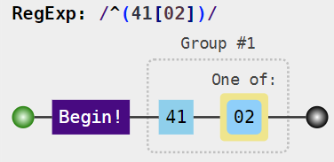
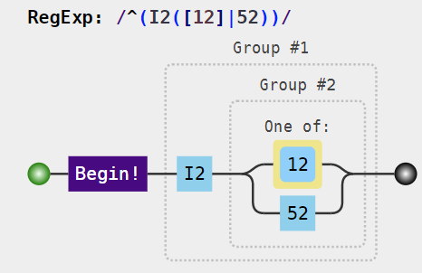

# Interpret regular expressions

``` r

library(coder)
```

Classcodes objects (as described in
[`vignette("classcodes")`](https://docs.ropensci.org/coder/articles/classcodes.md))
use regular expressions to classify/categorize individual codes into
groups (i.e. comorbidity conditions). Those regular expressions might be
hard to interpret on their own. Several methods are therefore available
to aid such interpretation of the classcodes objects.

## `visualize()`

A graphical representation of a classcodes object is created by
[`visualize()`](https://generics.r-lib.org/reference/visualize.html). It
will be showed in the default web browser (requires an Internet
connection; not available within this vignette).

``` r

visualize(charlson)
```

Visualization of all groups (comorbidity conditions) simultaneously
might lead to complex figures. We can focus on a specific group
(comorbidity) by the `group` argument. How is myocardial infarction
codified by `regex_icd9cm_deyo`?

``` r

visualize(charlson, "myocardial infarction", regex    = "icd9cm_deyo")
```



Hence, all ICD-9 codes starting with `41` followed by either `0` or `2`
will be recognized as myocardial infarction according to `icd9cm_deyo`.
The corresponding regular expression for ICD-10 is:

``` r

visualize(charlson, "myocardial infarction", regex = "icd10")
```



Such codes should start with `I2` followed by either `1`, `2` or `52`.
The vertical bar `|` (in the regular expression of the heading)
indicates a logical “or”. See
[`?regex`](https://rdrr.io/r/base/regex.html) for more details on how to
use regular expressions in R (Perl-like versions are currently not
allowed).

## `summary()`

An alternative representation is to list all relevant codes identified
by each regular expression. This is implemented by the
[`summary()`](https://rdrr.io/r/base/summary.html) method for classcodes
objects. Note, however, that the regular expressions are stand alone in
each classcodes object. Hence, there are no static look-up-tables to map
individual codes to each group. We therefore need to specify a code
list/dictionary of all possible codes to be recognized by those regular
expressions. Then [`summary()`](https://rdrr.io/r/base/summary.html)
will categorize those and display the result. Common code lists are
found in the [decoder](https://cancercentrum.bitbucket.io/decoder/)
package and are accessed automatically through the `coding` argument to
[`summary()`](https://rdrr.io/r/base/summary.html). Hence, there is a
“keyvalue” object `icd10cm` with all ICD-10-CM codes in `{decoder}:`

``` r

head(decoder::icd10cm)
#>     key                                              value
#> 1  A000 Cholera due to Vibrio cholerae 01, biovar cholerae
#> 2  A001    Cholera due to Vibrio cholerae 01, biovar eltor
#> 3  A009                               Cholera, unspecified
#> 4 A0100                         Typhoid fever, unspecified
#> 5 A0101                                 Typhoid meningitis
#> 6 A0102               Typhoid fever with heart involvement
```

We can use this code list to identify all codes recognized by `charlson`
with its default classification based on “icd10”. The printed result
(see
[`?print.summary.classcodes`](https://docs.ropensci.org/coder/reference/summary.classcodes.md))
is a tibble with each group and a comma separated code list.

``` r

s <- summary(charlson, coding = "icd10cm")
#> Classification based on: icd10
s
#> 
#> Summary of classcodes object
#> 
#> Recognized codes per group:
#> 
#> # A tibble: 17 × 3
#>    group                                n codes                                 
#>    <chr>                            <int> <chr>                                 
#>  1 AIDS/HIV                             1 B20                                   
#>  2 cerebrovascular disease            440 G450, G451, G452, G453, G454, G458, G…
#>  3 chronic pulmonary disease           75 I2781, I2782, I2783, I27840, I27841, …
#>  4 congestive heart failure            36 I099, I110, I130, I132, I255, I420, I…
#>  5 dementia                            80 F0150, F0151, F01511, F01518, F0152, …
#>  6 diabetes complication              233 E1021, E1022, E1029, E10311, E10319, …
#>  7 diabetes without complication       52 E1010, E1011, E10610, E10618, E10620,…
#>  8 hemiplegia or paraplegia            45 G041, G114, G801, G802, G8100, G8101,…
#>  9 malignancy                        1018 C000, C001, C002, C003, C004, C005, C…
#> 10 metastatic solid tumor              48 C770, C771, C772, C773, C774, C775, C…
#> 11 mild liver disease                  41 B180, B181, B182, B188, B189, K700, K…
#> 12 moderate or severe liver disease    14 I8500, I8501, I864, K7040, K7041, K71…
#> 13 myocardial infarction               19 I2101, I2102, I2109, I2111, I2119, I2…
#> 14 peptic ulcer disease                36 K250, K251, K252, K253, K254, K255, K…
#> 15 peripheral vascular disease        293 I700, I701, I70201, I70202, I70203, I…
#> 16 renal disease                       27 I120, I1310, I1311, N032, N033, N034,…
#> 17 rheumatic disease                  353 M0500, M05011, M05012, M05019, M05021…
#> 
#>  Use function visualize() for a graphical representation.
```

A list with all code vectors (to use for programmatic purposes) is also
returned (invisible) and accessed by `s$codes_vct`.

Now, compare the result above with the output based on a different code
list, namely ICD-10-SE, the Swedish version of ICD-10, instead of
ICD-10-CM:

``` r

summary(charlson, coding = "icd10se")
#> Classification based on: icd10
#> 
#> Summary of classcodes object
#> 
#> Recognized codes per group:
#> 
#> # A tibble: 17 × 3
#>    group                                n codes                                 
#>    <chr>                            <int> <chr>                                 
#>  1 AIDS/HIV                            26 B20, B200, B201, B202, B203, B204, B2…
#>  2 cerebrovascular disease             94 G45, G450, G451, G452, G453, G454, G4…
#>  3 chronic pulmonary disease           73 I278, I279, J40, J409, J41, J410, J41…
#>  4 congestive heart failure            25 I099, I110, I130, I132, I255, I420, I…
#>  5 dementia                            28 F00, F000, F001, F002, F009, F01, F01…
#>  6 diabetes complication               71 E102, E102A, E102B, E102C, E102W, E10…
#>  7 diabetes without complication       55 E100, E100A, E100B, E100C, E100D, E10…
#>  8 hemiplegia or paraplegia            24 G041, G114, G801, G801A, G801B, G801X…
#>  9 malignancy                         608 C00, C000, C001, C002, C003, C004, C0…
#> 10 metastatic solid tumor              33 C77, C770, C771, C772, C773, C774, C7…
#> 11 mild liver disease                  86 B18, B180, B180A, B180B, B180C, B180D…
#> 12 moderate or severe liver disease    11 I850, I859, I864, I982, K704, K711, K…
#> 13 myocardial infarction               17 I21, I210, I211, I212, I213, I214, I2…
#> 14 peptic ulcer disease                40 K25, K250, K251, K252, K253, K254, K2…
#> 15 peripheral vascular disease         49 I70, I700, I700A, I700B, I700X, I701,…
#> 16 renal disease                       29 I120, I131, N032, N033, N034, N035, N…
#> 17 rheumatic disease                   68 M05, M050, M051, M052, M053, M058, M0…
#> 
#>  Use function visualize() for a graphical representation.
```

There are some noticeable differences. AIDS/HIV for example has only one
code deemed clinically relevant in the USA (thus included in the
CM-version of ICD-10), although there are 22 different codes potentially
used in the Swedish national patient register. There are additional
differences concerning the fifth code position (digits in ICD-10-CM and
characters in ICD-10-SE). Those mark national modifications to the
original ICD-10 codes, which has only 4 positions (one character and
three digits). For this example, the `charlson$icd10` column was based
on ICD-10-CM (Quan et al. 2005). The comparison above thus highlights
potential differences when using this classification in a setting based
on another classification (such as with data from the Swedish national
patient register).

If we are interested in another code version, for example as specified
by ICD-9-CM (Deyo et al. 1992) , this can be specified by the
`regex`-argument passed by the `cc_args` argument to the
`set_classcodes` function. Simultaneously, the `coding` argument is set
to `icd9cmd` to match the regular expressions to the disease part of
ICD-9-CM classification.

``` r

summary(
  charlson, coding = "icd9cmd",
  cc_args = list(regex = "icd9cm_deyo")
)
#> 
#> Summary of classcodes object
#> 
#> Recognized codes per group:
#> 
#> # A tibble: 17 × 3
#>    group                                n codes                                 
#>    <chr>                            <int> <chr>                                 
#>  1 AIDS/HIV                             1 042                                   
#>  2 cerebrovascular disease             69 430, 431, 4320, 4321, 4329, 43300, 43…
#>  3 chronic pulmonary disease            8 490, 500, 501, 502, 503, 504, 505, 50…
#>  4 congestive heart failure            15 4280, 4281, 42820, 42821, 42822, 4282…
#>  5 dementia                            14 2900, 29010, 29011, 29012, 29013, 290…
#>  6 diabetes complication               12 25040, 25041, 25042, 25043, 25050, 25…
#>  7 diabetes without complication       20 25000, 25001, 25002, 25003, 25010, 25…
#>  8 hemiplegia or paraplegia            13 34200, 34201, 34202, 34210, 34211, 34…
#>  9 malignancy                         628 1400, 1401, 1403, 1404, 1405, 1406, 1…
#> 10 metastatic solid tumor              30 1960, 1961, 1962, 1963, 1965, 1966, 1…
#> 11 mild liver disease                   7 5712, 57140, 57141, 57142, 57149, 571…
#> 12 moderate or severe liver disease     6 4560, 4561, 5722, 5723, 5724, 5728    
#> 13 myocardial infarction               31 41000, 41001, 41002, 41010, 41011, 41…
#> 14 peptic ulcer disease                72 53100, 53101, 53110, 53111, 53120, 53…
#> 15 peripheral vascular disease         15 44100, 44101, 44102, 44103, 4411, 441…
#> 16 renal disease                       26 5820, 5821, 5822, 5824, 58281, 58289,…
#> 17 rheumatic disease                    8 7100, 7101, 7104, 7140, 7141, 7142, 7…
#> 
#>  Use function visualize() for a graphical representation.
```

## 

## `codebook()`

Even with individual codes summarized, those might still be hard to
interpret on their own. The
[decoder](https://cancercentrum.bitbucket.io/decoder/) package can help
to translate codes to readable names/description. This is facilitated by
the
[`codebook()`](https://docs.ropensci.org/coder/reference/codebook.md)
function in the [coder](https://docs.ropensci.org/coder/) package.

The main purpose is to export an Excel-file (if path specified by
argument `file`). The output is otherwise a list, including both a
summary table (described above) and a tibble with “all_codes” explaining
the meaning of each code.

We can compare the codes recognized as AIDS/HIV by either ICD-10-CM or
ICD-10-SE:

``` r


cm <- codebook(charlson, "icd10cm")$all_codes
#> Classification based on: icd10
cm[cm$group == "AIDS/HIV", ]
#> # A tibble: 1 × 3
#>   code  description                                group   
#>   <chr> <chr>                                      <chr>   
#> 1 B20   Human immunodeficiency virus [HIV] disease AIDS/HIV

se <- codebook(charlson, "icd10se")$all_codes
#> Classification based on: icd10
se[se$group == "AIDS/HIV", ]
#> # A tibble: 26 × 3
#>    code  description                                                       group
#>    <chr> <chr>                                                             <chr>
#>  1 B20   Sjukdom orsakad av humant immunbristvirus [HIV] tillsammans med … AIDS…
#>  2 B200  HIV-infektion med mykobakterieinfektion                           AIDS…
#>  3 B201  HIV-infektion med andra bakterieinfektioner                       AIDS…
#>  4 B202  HIV-infektion med cytomegalvirusinfektion                         AIDS…
#>  5 B203  HIV-infektion med andra virusinfektioner                          AIDS…
#>  6 B204  HIV-infektion med candidainfektion                                AIDS…
#>  7 B205  HIV-infektion med andra mykoser                                   AIDS…
#>  8 B206  HIV-infektion med Pneumocystis jirovecii (carinii)-pneumoni       AIDS…
#>  9 B207  HIV-infektion med multipla infektioner                            AIDS…
#> 10 B208  HIV-infektion med andra infektions- och parasitsjukdomar          AIDS…
#> # ℹ 16 more rows
```

## `codebooks()`

Several codebooks can be combined (exported to a single Excel-file) by
the function
[`codebooks()`](https://docs.ropensci.org/coder/reference/codebook.md)
(note the plural s). This is difficult to illustrate in a vignette but
examples are provided in
[`?codebooks`](https://docs.ropensci.org/coder/reference/codebook.md)

## Bibliography

Deyo, Richard A., Daniel C. Cherkin, and Marcia A. Ciol. 1992. “Adapting
a Clinical Comorbidity Index for Use with ICD-9-CM Administrative
Databases.” *Journal of Clinical Epidemiology* 45 (6): 613–19.
<https://doi.org/10.1016/0895-4356(92)90133-8>.

Quan, Hude, Vijaya Sundararajan, Patricia Halfon, et al. 2005. “Coding
Algorithms for Defining Comorbidities in ICD-9-CM and ICD-10
Administrative Data.” *Medical Care* 43 (11): 1130–39.
<https://doi.org/10.1097/01.mlr.0000182534.19832.83>.
