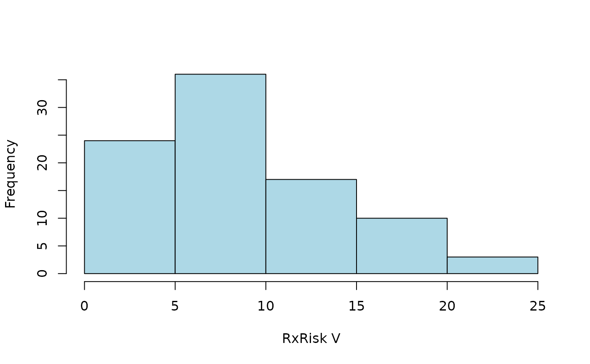
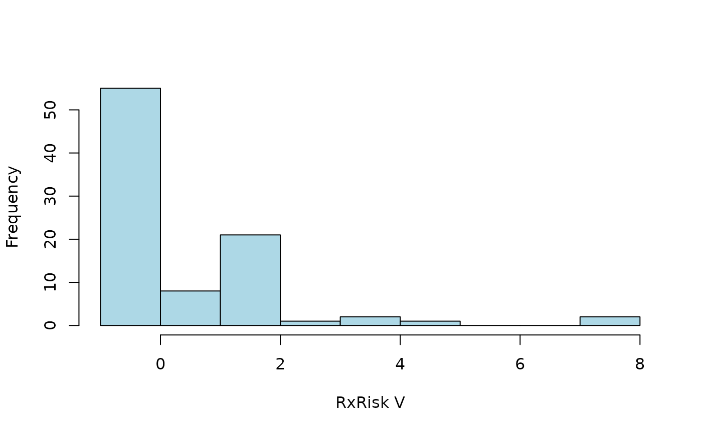
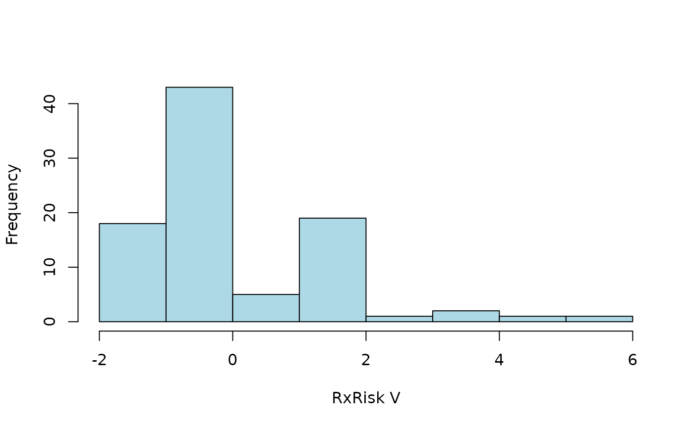
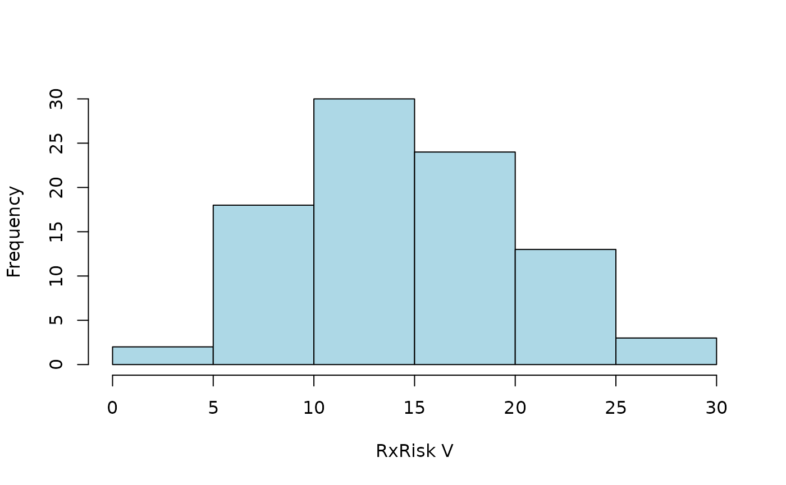

# coder

The `coder` package simplifies unit classification based on external
code data. this is a generic aim that might be hard to grasp without
further concretization. In this vignette, I will first explain the
overall design principles, and then exemplify the concept with a typical
use case involving patients with total hip arthroplasty (THA) and their
pre-surgery comorbidity. Note, however, that the package is not limited
to patient data or medical settings.

``` r

library(coder)
```

## Triad of objects

Functions of the package relies on a triad of objects:

1.  Case data with unit id:s and possible dates of interest
2.  External code data for corresponding units in (1) and with optional
    dates of interest and
3.  A classification scheme (‘classcodes’ object) with regular
    expressions to identify and categorize relevant codes from (2).

It is easy to introduce new classification schemes (‘classcodes’
objects) or to use default schemes included in the package (see
[`vignette("classcodes")`](https://docs.ropensci.org/coder/articles/classcodes.md)).

## Triad of functions

There are three important functions to control the intended work flow of
the package:

1.  [`codify()`](https://docs.ropensci.org/coder/reference/codify.md)
    will merge object (1) and (2) for a coded data set of the intended
    format. If optional dates are specified, those will be used to
    construct time windows in order to filter out only the important
    dates (i.e. comorbidity during one year before surgery or adverse
    events 90 days after).
2.  [`classify()`](https://docs.ropensci.org/coder/reference/classify.md)
    will then use the coded data and classify it using the `classcodes`
    object (3) (i.e. to code comorbidity data by the Charlson or
    Elixhauser comorbidity classifications).
3.  [`index()`](https://docs.ropensci.org/coder/reference/index_fun.md)
    is a third optional step to summarize the individual `classcodes`
    categories to a (possibly weighted) index sum for each coded item
    (i.e. to calculate the Charlson comorbidity index for each patient).

Those steps could be performed explicitly as
`codify() %>% classify() %>% index()` or implicitly by the main function
[`categorize()`](https://docs.ropensci.org/coder/reference/categorize.md)
combining all steps automatically.

## Use case

A typical use case of the `coder` package would consider patient data
and comorbidity as described in the package
[readme](https://docs.ropensci.org/coder/).

The concept of comorbidity is often attributed to Feinstein (1970):

> \[T\]he term co-morbidity will refer to any distinct additional
> clinical entity that has existed or that may occur during the clinical
> course of a patient who has the index disease under study.

Let’s consider a group of patients with THA, as identified from a
national quality register, which might be large in size. Assume we are
interested in those patients’ pre-surgery comorbidity, which is not
captured by the quality register itself. Instead, this data might be
codified in a secondary source, such as a national patient register
containing all hospital visits and admissions during several years, both
before and after the THA-surgery. Each hospital visit/admission might be
recorded with one or several medical codes, for example using the
International classification of diseases version 10 (ICD-10). Similarly,
a medical prescription register might hold records of prescribed drugs
with their corresponding codes from the Anatomic therapeutic chemical
classification (ATC) system.

Thus, combining the primary and secondary data sets (objects 1-2 above)
using some unique patient id, and a possible time window (i.e. to only
consider comorbidity as recorded during one year before the THA), is a
first step to identify patient comorbidity. This step is performed by
the [`codify()`](https://docs.ropensci.org/coder/reference/codify.md)
function in step (i) above.

We have now gathered all the relevant codes for each patient. Common
classifications (i.e. ICD-10 and ATC) are wast, however, including tens
of thousands of medical/chemical codes, which are cumbersome and
impractical to use directly. It is therefore common to categorize such
codes into broader categories (i.e. by the Charlson, Elixhauser or
RxRisk V classifications as below). Such classification could be a
simple code matching problem using a look-up table. This is generally a
slow, cumbersome and error-prone process, however. I therefore recommend
to use regular expression for a compact code representation, as well as
a computationally faster procedure. This is implemented in the
[`classify()`](https://docs.ropensci.org/coder/reference/classify.md)
function from step (ii) above.

We have now reduced the data from tens of thousands of codes to perhaps
10-50 combined categories. This might be sufficient in some cases,
although further simplifications might also be needed. It is thus common
to simplify comorbidity into a single number, an index score, as the sum
of individual comorbidities, possible weighted to differentiate more
serious conditions from more trivial. Different weights might be of
relevance under different circumstances or in different fields. This is
implemented by the
[`index()`](https://docs.ropensci.org/coder/reference/index_fun.md)
function in step (iii) above.

## Charlson and Elixhauser

The Charlson (1987) and Elixhauser (1998) comorbidity indices are two
examples used in medical research. Each index consist of several medical
conditions, possibly summarized by a (weighted) index. Each condition is
defined by a set of medical codes (Quan et al. 2005). Different versions
of the International Classification of Diseases (ICD) codes are often
used.

The `coder` package provides substantial functionality for both Charlson
and Elixhauser, although we will not focus on those indices here (but
see examples in
[`vignette("classcodes")`](https://docs.ropensci.org/coder/articles/classcodes.md)).
Several other R packages have functions for Charlson and Elixhauser:

- [icd (CRAN)](https://CRAN.R-project.org/package=icd)
- [comorbidity (CRAN)](https://CRAN.R-project.org/package=comorbidity)
- [medicalrisk (CRAN)](https://CRAN.R-project.org/package=medicalrisk)
- [comorbidities.icd10
  (GitHub)](https://github.com/gforge/comorbidities.icd10)
- [icdcoder (GitHub)](https://github.com/wtcooper/icdcoder)

`icd` and `comorbidity` are both good packages well suited for their
purpose based on effective implementations. `medicalrisk` can be used
with ICD-9-CM codes but is not up-to-date with the latest version of
ICD-10. `comorbidities.icd10` and `icdcoder` are not actively developed
or maintained.

One advantage with the `coder` package is the great flexibility for
combining different sets of codes (ICD-8, ICD-9, ICD-9-CM and ICD-10 et
cetera), with different weighted indices.

## Risk Rx V

Another advantage of the `coder` package is the inclusion of additional
classifications (see `?all_classcodes()`), such as the pharmacy-based
case-mix instrument Rx Risk V (Sloan et al. 2003). We will use this
classification in an example. This classification, in contrast to
Charlson and Elixhauser, relies on medical prescription data codified by
the Anatomic Therapeutic Chemical classification system (ATC).

As for all classcodes objects in the package, additional information and
references are found in the object documentation
([`?rxriskv`](https://docs.ropensci.org/coder/reference/rxriskv.md)).

## Concrete example

Let us consider the hypothetical setting above using some example data
(`ex_peopple` and `ex_atc`) as described in
[`vignette("ex_data")`](https://docs.ropensci.org/coder/articles/ex_data.md).

## Default categorization

A first attempt to calculate the Rx Risk V score for each patient:

``` r

default <- categorize(
    ex_people, codedata = ex_atc, cc = rxriskv, id = "name", code = "atc")
#> Classification based on: atc_pratt
default
#> # A tibble: 100 × 50
#>    name     surgery    Alcohol.dependence Allergies Anticoagulants Antiplatelets
#>    <chr>    <date>     <lgl>              <lgl>     <lgl>          <lgl>        
#>  1 Chen, T… 2025-04-21 FALSE              TRUE      TRUE           FALSE        
#>  2 Graves,… 2025-01-11 FALSE              FALSE     FALSE          FALSE        
#>  3 Trujill… 2024-12-29 FALSE              FALSE     FALSE          FALSE        
#>  4 Simpson… 2025-04-02 FALSE              TRUE      FALSE          FALSE        
#>  5 Chin, N… 2025-03-16 FALSE              FALSE     FALSE          TRUE         
#>  6 Le, Chr… 2024-10-18 FALSE              FALSE     FALSE          FALSE        
#>  7 Kang, X… 2025-01-20 FALSE              TRUE      FALSE          TRUE         
#>  8 Shuemak… 2024-10-19 FALSE              FALSE     FALSE          FALSE        
#>  9 Boucher… 2025-03-27 FALSE              FALSE     FALSE          FALSE        
#> 10 Le, Sor… 2025-03-01 FALSE              FALSE     FALSE          FALSE        
#> # ℹ 90 more rows
#> # ℹ 44 more variables: Anxiety <lgl>, Arrhythmia <lgl>,
#> #   Benign.prostatic.hyperplasia <lgl>, Bipolar.disorder <lgl>,
#> #   Chronic.airways.disease <lgl>, Congestive.heart.failure <lgl>,
#> #   Dementia <lgl>, Depression <lgl>, Diabetes <lgl>, Epilepsy <lgl>,
#> #   Gastrooesophageal.reflux.disease <lgl>, Glaucoma <lgl>, Gout <lgl>,
#> #   Hepatitis.B <lgl>, Hepatitis.C <lgl>, HIV <lgl>, Hyperkalaemia <lgl>, …
```

The first two columns are identical to `ex_people`. Additional columns
indicate whether patients had any of the individual comorbidities
identified by Rx Risk V. Patients without any medical prescriptions have
`NA` values (which might be substituted by `FALSE`). The last columns
contain summarized index values (weighted sums of individual
comorbidities). Let’s summarize the distribution of a weighted index
according to `pratt` (Pratt et al. 2018):

``` r

hist2 <- function(x) {
  hist(x$pratt, main = NULL, xlab = "RxRisk V", col = "lightblue")
}
hist2(default)
```



## Specified time-window

Some prescriptions might have been filed long before surgery, or even
after. Those codes are less relevant for comorbidities present at
surgery. We can limit the categorization to a time window of one year
(365 days) prior to surgery. This is done internally by the
[`codify()`](https://docs.ropensci.org/coder/reference/codify.md)
function, hence by specifying a list of arguments passed to this
function:

``` r

codify_args <- 
  list(date = "surgery", code_date = "prescription", days = c(-365, -1))

ct <- 
  categorize(
    ex_people, 
    codedata    = ex_atc, 
    cc          = rxriskv, 
    id          = "name", 
    code        = "atc", 
    codify_args = codify_args
  )
#> Classification based on: atc_pratt
  
hist2(ct)
```



## Alternative classification

Comorbidities are identified from ATC codes captured by regular
expression (see
[`vignette("classcodes")`](https://docs.ropensci.org/coder/articles/classcodes.md)
and `vignette("Intrpret_regular_expressions")`). Codes identified by
`atc_pratt` are used by default. Let’s use an alternative version
adopted from Caughy (2010) as specified by an argument passed by the
`cc_args` argument.

``` r

hist2(
  categorize(
    ex_people, 
    codedata      = ex_atc, 
    cc            = rxriskv, 
    id            = "name", 
    code          = "atc",
    codify_args   = codify_args,
    cc_args       = list(regex = "caughey")
  )
)
```



## Specified index

We did not specify how to calculate the weighted index sum above,
wherefore all available indices were provided by default. We might go
back to Pratt’s classification scheme (`atc_pratt`) and only calculate
the corresponding index `pratt`. Let´s also perform the three
computational steps explicitly instead of using the combining
[`categorize()`](https://docs.ropensci.org/coder/reference/categorize.md)
function and tabulate the result

``` r

codify(
  ex_people, 
  ex_atc, 
  id        = "name", 
  code      = "atc",  
  date      = "surgery", 
  code_date = "prescription",
  days      = c(-365, -1)
) %>% 
  classify(rxriskv) %>% 
  index("pratt") %>% 
  table()
#> Warning: 'classify()' does not preserve row order ('categorize()' does!)
#> Classification based on: atc_pratt
#> .
#> -1  0  1  2  3  4  5  8 
#> 12 43  8 21  1  2  1  2
```

## Dirty code data

Let’s assume that our code data is not as clean as simulated above.

``` r

s <- function(x) sample(x, 1e3, replace = TRUE)

ex_atc$code <- 
  paste0(
    s(letters), s(0:9), s(letters), s(c(".", "-", "?")), 
    ex_atc$atc, s(letters), s(0:9)
  )

ex_atc
#> # A tibble: 10,000 × 4
#>    name                 atc      prescription code          
#>    <chr>                <chr>    <date>       <chr>         
#>  1 Le, Soraiya          L03AA16  2023-01-23   m5g.L03AA16h7 
#>  2 Cleveland, Mark      J07CA01  2020-10-02   w3p.J07CA01m1 
#>  3 Santistevan, Charlie QJ57EA06 2016-03-13   l3d.QJ57EA06f2
#>  4 Meier, Hayden        R03DB04  2021-07-14   e8o-R03DB04s5 
#>  5 Hill, Audrey         V09IA01  2018-12-27   f3s.V09IA01s1 
#>  6 Thumma, Phillip      L02AE02  2015-02-04   o8j?L02AE02t3 
#>  7 Yost, Rebecca        S01EB06  2019-06-29   o8j?S01EB06r7 
#>  8 Mandakh, Joseph      A03DA01  2021-01-30   d7w-A03DA01k8 
#>  9 Meier, Hayden        C09AA13  2023-07-22   f3n-C09AA13m5 
#> 10 Trinh, Schuyler      A07EA03  2025-05-21   i7r?A07EA03n8 
#> # ℹ 9,990 more rows

sum(
  categorize(
    ex_people, 
    codedata = ex_atc, 
    cc       = rxriskv, 
    id       = "name",
    code     = "code"
  )$pratt,
  na.rm      = TRUE
)
#> Classification based on: atc_pratt
#> [1] 0
```

Thus, no codes are recognized (every one got index = 0). By default,
codes are only recognized if found immediate in its corresponding
column. This can be controlled by arguments `start` and `stop` specified
via `cc_args`. We can also ignore all non alphanumeric characters by
setting `alnum = TRUE` as passed to
[`codify()`](https://docs.ropensci.org/coder/reference/codify.md) by
argument `codify_args`.

``` r

hist2(
  categorize(
    ex_people, 
    codedata = ex_atc, 
    cc       = rxriskv, 
    id       = "name",
    code     = "code",
    cc_args  = list(
      start  = FALSE, 
      stop   = FALSE
    ),
    codify_args = list(
      alnum = TRUE
    )
  )
)
#> Classification based on: atc_pratt
```



## Bibliography

Caughey, Gillian E., Elizabeth E. Roughead, Agnes I. Vitry, Robyn A.
McDermott, Sepehr Shakib, and Andrew L. Gilbert. 2010. “Comorbidity in
the Elderly with Diabetes: Identification of Areas of Potential
Treatment Conflicts.” *Diabetes Research and Clinical Practice* 87 (3):
385–93. <https://doi.org/10.1016/j.diabres.2009.10.019>.

Charlson, Mary E., Peter Pompei, Kathy L. Ales, and C. Ronald MacKenzie.
1987. “A New Method of Classifying Prognostic Comorbidity in
Longitudinal Studies: Development and Validation.” *Journal of Chronic
Diseases* 40 (5): 373–83.
<https://doi.org/10.1016/0021-9681(87)90171-8>.

Elixhauser, Anne, Claudia Steiner, D Robert Harris, and Rosanna M
Coffey. 1998. “Comorbidity Measures for Use with Administrative Data.”
*Medical Care* 36 (1): 8–27.

Feinstein, Alvan R. 1970. “The Pre-Therapeutic Classification of
Co-Morbidity in Chronic Disease.” *Journal of Chronic Diseases* 23 (7):
455–68. https://doi.org/<https://doi.org/10.1016/0021-9681(70)90054-8>.

Pratt, Nicole L., Mhairi Kerr, John D. Barratt, et al. 2018. “The
Validity of the Rx-Risk Comorbidity Index Using Medicines Mapped to the
Anatomical Therapeutic Chemical (ATC) Classification System.” *BMJ Open*
8 (4). <https://doi.org/10.1136/bmjopen-2017-021122>.

Quan, Hude, Vijaya Sundararajan, Patricia Halfon, et al. 2005. “Coding
Algorithms for Defining Comorbidities in ICD-9-CM and ICD-10
Administrative Data.” *Medical Care* 43 (11): 1130–39.
<https://doi.org/10.1097/01.mlr.0000182534.19832.83>.

Sloan, Kevin L, Anne E Sales, Chuan-Fen Liu, et al. 2003. “Construction
and Characteristics of the RxRisk-v: A VA-Adapted Pharmacy-Based
Case-Mix Instrument.” *Medical Care* 41 (6): 761–74.
<https://doi.org/10.1097/01.MLR.0000064641.84967.B7>.
